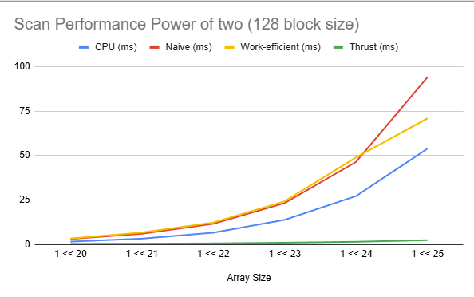
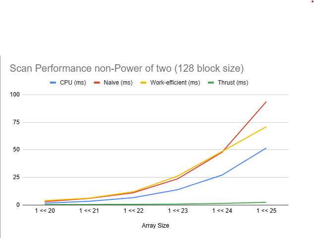

 CUDA Stream Compaction
======================

**University of Pennsylvania, CIS 565: GPU Programming and Architecture, Project 2**

* Harry Guan
* (TODO) [LinkedIn]()
* Tested on:  Windows 11, Intel i7-14700 @ 2.10GHz 32GB, NVIDIA T1000 4GB (Moore 100B virtual labs)

### Project Overview
This project implements GPU stream compaction algorithms in CUDA, focusing on the fundamental parallel algorithms of scan (prefix sum) and stream compaction. 
Stream compaction is a crucial operation that removes unwanted elements (zeros in this case) from an array while maintaining the relative order of the remaining elements. 
This algorithm is essential for GPU path tracing and other parallel algorithms.

Example:
```
Input:  [1, 5, 0, 1, 2, 0, 3]
Flags:  [1, 1, 0, 1, 1, 0, 1]
Scan:   [0, 1, 2, 2, 3, 4, 4]
Output: [1, 5, 1, 2, 3]
```

### Features Implemented
- **CPU Implementations**:
  - **scan**: Exclusive prefix sum using simple for loop
  - **compactWithoutScan**: Stream compaction without using scan
  - **compactWithScan**: Stream compaction using scan and scatter


### Naive Scan

A algorithm that uses global memory exclusively. In each of `log(n)` passes, it adds elements together at increasing strides.

- **Approach**: Launches a thread per element, adds pairs with increasing offsets.
- **Time Complexity**: `O(n log n)`
- **Limitation**: A separate kernel launch per pass introduces **serialization overhead**, reducing performance.

###  Work-Efficient Scan

A more optimized approach that reduces redundant computations and kernel launches. It processes the data in two phases:

#### Up-Sweep Phase
- Builds a balanced binary tree of partial sums.

#### Down-Sweep Phase
- Traverses the tree in reverse to compute the exclusive scan results.

- **Time Complexity**: `O(n)`
- **Advantage**: Significantly more efficient than the naive version.

### 4. Thrust Scan

A wrapper around the **Thrust** library’s `exclusive_scan`:

- Provides a benchmark for performance comparison.
- Highly optimized and production-ready.

Stream compaction follows a three-step process:

1. **Map**: Convert input array to boolean flags (1 for non-zero, 0 for zero)
2. **Scan**: Compute exclusive prefix sum of the boolean array
3. **Scatter**: Place non-zero elements at positions given by the scan results

## Performance Analysis
	
## Block size optimization
| Block size | naive scan, power-of-two (ms) | naive scan, non-power-of-two (ms) | work-efficient scan, power-of-two (ms) | work-efficient scan, non-power-of-two (ms) |
| :--- | :--- | :--- | :--- | :--- |
| 128 | 5.36 | 5.4 | 2.37 | 2.34 |
| 256 | 6.05 | 5.4 | 2.6 | 2.39 |
| 512 | 5.7 | 6.17 | 2.61 | 2.5 |
| 1024 | 5.85 | 6.39 | 2.71 | 2.56 |


Having a look at the run time, tt seem like block size does not have a significant impact on performance. But the best performance for naive scan is at block size 128, while work-efficient scan performs best at block size 128 as well. So we would examine our tests using block size of 128 for both Work efficient and Naive.

## Size of an array runtime analysis  (Compare all of these GPU Scan implementations (Naive, Work-Efficient, and Thrust) to the serial CPU version of Scan. Plot a graph of the comparison (with array size on the independent axis).)



Thrust crushes everything (0.49–2.54 ms) and easily beats my CPU (1.73–53.87 ms) at all sizes. My work‑efficient scan improves on naive but still trails the CPU, while naive is consistently the slowest. Overall: Thrust >> CPU > work‑efficient > naive, for both power‑of‑two and non‑power‑of‑two arrays.

## Can you find the performance bottlenecks? Is it memory I/O? Computation? Is it different for each implementation?
**CPU**: The CPU scan consistently beats thr GPU kernels at all sizes. Its single‑pass that is cache friendly. Even at 1<<25 the CPU (≈53.9 ms) is still ahead of naive (≈94.1 ms) and work‑efficient scan (≈70.9 ms), making CPU second overall behind Thrust.

**Naive**: For small arrays it can be okay, but because it's very simple work on the GPU. But it repeats the same kind of work many times, so as an array grows, the repeated passes add up and it falls behind the Work-efficient algorithm. 

**Work‑Efficient**:  It does less total work than naive, but it involves more coordination between threads. For small arrays, that coordination overhead outweighs the benefit, so it can be slower than naive. As arrays get bigger, the small work it had to do starts to matter and it pulls ahead of the naive, which you can see. 

**Thrust**: Thrust is by far the fastest in the data (≈0.49–2.54 ms). Unfortunately, due to lack of permission from nsight systems I'm unable to capture a profile of its internal workings. However, Thrust is a highly optimized library that likely employs advanced techniques such as shared memory usage and other optimizations to minimize global memory accesses and kernel launches. This results in its superior performance compared to both my CPU and custom GPU implementations.

### Test Results
```
****************
** SCAN TESTS **
****************
    [  29  28  20   1  20  13  37  39   2   7  37  36  29 ...  29   0 ]
==== cpu scan, power-of-two ====
   elapsed time: 1.6521ms    (std::chrono Measured)
    [   0  29  57  77  78  98 111 148 187 189 196 233 269 ... 25686366 25686395 ]
==== cpu scan, non-power-of-two ====
   elapsed time: 1.6747ms    (std::chrono Measured)
    [   0  29  57  77  78  98 111 148 187 189 196 233 269 ... 25686263 25686301 ]
    passed
==== naive scan, power-of-two ====
   elapsed time: 3.05206ms    (CUDA Measured)
    passed
==== naive scan, non-power-of-two ====
   elapsed time: 3.13402ms    (CUDA Measured)
    passed
==== work-efficient scan, power-of-two ====
   elapsed time: 4.04442ms    (CUDA Measured)
    passed
==== work-efficient scan, non-power-of-two ====
   elapsed time: 3.39414ms    (CUDA Measured)
    passed
==== thrust scan, power-of-two ====
   elapsed time: 0.472384ms    (CUDA Measured)
    passed
==== thrust scan, non-power-of-two ====
   elapsed time: 0.44912ms    (CUDA Measured)
    passed

*****************************
** STREAM COMPACTION TESTS **
*****************************
    [   1   0   2   1   2   1   3   1   2   1   3   0   1 ...   1   0 ]
==== cpu compact without scan, power-of-two ====
   elapsed time: 1.9785ms    (std::chrono Measured)
    [   1   2   1   2   1   3   1   2   1   3   1   2   1 ...   3   1 ]
    passed
==== cpu compact without scan, non-power-of-two ====
   elapsed time: 1.8681ms    (std::chrono Measured)
    [   1   2   1   2   1   3   1   2   1   3   1   2   1 ...   2   2 ]
    passed
==== cpu compact with scan ====
   elapsed time: 4.8619ms    (std::chrono Measured)
    [   1   2   1   2   1   3   1   2   1   3   1   2   1 ...   3   1 ]
    passed
==== work-efficient compact, power-of-two ====
   elapsed time: 5.77722ms    (CUDA Measured)
    passed
==== work-efficient compact, non-power-of-two ====
   elapsed time: 5.46666ms    (CUDA Measured)
    passed
```